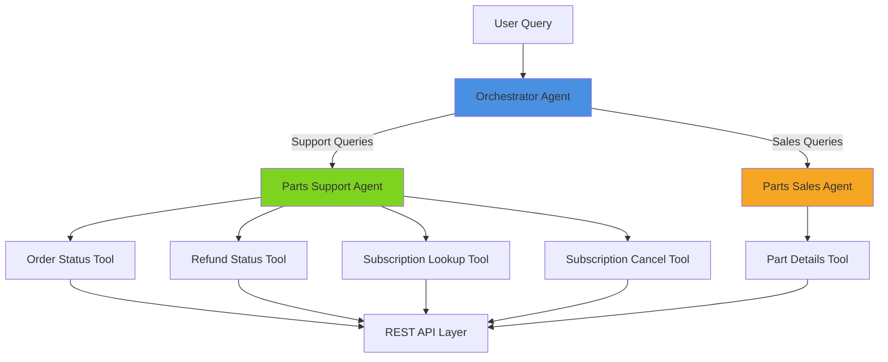

# Multi-Agent Orchestration Framework

A Python-based framework for building hierarchical multi-agent systems with specialized agents and function tools. This project demonstrates an orchestrated agent architecture for handling complex business workflows through intelligent agent collaboration.

[](https://www.python.org/downloads/)
[](https://opensource.org/licenses/MIT)
[](https://github.com/psf/black)
[](https://github.com/yourusername/multi-agent-orchestration-framework/actions)

## 🚀 Features

- **Hierarchical Agent Architecture**: Orchestrator pattern with specialized agents for different domains
- **Conversation Context Management**: Multi-turn conversation support with intelligent context retention
- **Function Tool Integration**: Clean separation between API wrappers and agent logic
- **Async/Await Support**: Built with modern Python async patterns for efficient execution
- **Modular Design**: Extensible framework for adding new agents and tools
- **Real-world Use Case**: Parts support and sales workflow automation with live AWS API integration
- **Type-Safe**: Comprehensive type hints throughout the codebase
- **Interactive CLI**: User-friendly command-line interface for testing and demonstrations

## 📋 Table of Contents

- [Architecture](#architecture)
- [Installation](#installation)
- [Quick Start](#quick-start)
- [Project Structure](#project-structure)
- [Usage Examples](#usage-examples)
- [API Documentation](#api-documentation)
- [Configuration](#configuration)
- [Development](#development)
- [Contributing](#contributing)
- [License](#license)

## 🏗️ Architecture

The framework implements a hierarchical multi-agent system with three layers:



### Key Components

1. **Orchestrator Agent**: Routes queries to specialized agents based on intent
2. **Parts Support Agent**: Handles order status, refunds, and subscription management
3. **Parts Sales Agent**: Manages product inquiries, compatibility checks, and shipping info
4. **Function Tools**: Wrapper functions that integrate with backend APIs

## 💻 Installation

### Prerequisites

- Python 3.8 or higher
- pip package manager
- OpenAI API key (for agent functionality)

### Setup

1. Clone the repository:
```bash
git clone https://github.com/yourusername/multi-agent-orchestration-framework.git
cd multi-agent-orchestration-framework
```

2. Create a virtual environment:
```bash
python -m venv venv
source venv/bin/activate  # On Windows: venv\Scripts\activate
```

3. Install dependencies:
```bash
pip install -r requirements.txt
```

4. Configure environment variables:
```bash
cp .env.example .env
# Edit .env with your API keys and configuration
```

## 🚦 Quick Start

### Basic Usage

```python
from src.agents.orchestrator_agent import create_orchestrator
from agents import Runner
import asyncio

async def main():
    # Create the orchestrator agent
    orchestrator = create_orchestrator()
    
    # Initialize runner
    runner = Runner()
    
    # Execute a query
    query = "Check order status for order W174191 with zip 20020"
    result = await runner.run(orchestrator, query)
    
    print(f"Response: {result}")

# Run the async function
asyncio.run(main())
```

### Interactive Demo

Run the interactive CLI demo with **conversation context support**:

```bash
python examples/demo_cli.py
```

The demo remembers your conversation history, enabling natural multi-turn interactions:

**Multi-turn conversation example:**
```
You: Looking for my subscription
Bot: Could you please provide your phone number or membership ID?
You: 5127091519
Bot: [Returns subscription details for phone number 5127091519]
```

**Single-turn query examples:**
- "Check order status for order W174191 with zip 20020"
- "Check refund status for order E001861"
- "Get subscription details for membership ID 8282916880"
- "Need part details for part number 1-17548-006"

## 📁 Project Structure

```
multi-agent-orchestration-framework/
├── src/
│   ├── agents/                 # Agent definitions
│   │   ├── base_agent.py      # Base agent interface
│   │   ├── parts_support_agent.py
│   │   ├── parts_sales_agent.py
│   │   └── orchestrator_agent.py
│   ├── tools/                  # Function tools
│   │   ├── order_tools.py     # Order status & refund tools
│   │   ├── subscription_tools.py
│   │   └── parts_tools.py     # Parts lookup tools
│   ├── api/                    # API client layer
│   │   ├── client.py          # HTTP client wrapper
│   │   └── config.py          # API configuration
│   └── utils/                  # Utility functions
│       └── helpers.py
├── examples/                   # Usage examples
│   ├── basic_usage.py
│   ├── advanced_orchestration.py
│   └── demo_cli.py
├── tests/                      # Unit tests
│   ├── test_agents.py
│   ├── test_tools.py
│   └── test_orchestration.py
├── docs/                       # Documentation
│   ├── architecture.md
│   ├── api_reference.md
│   └── diagrams/
└── requirements.txt
```

## 📚 Usage Examples

### Example 1: Order Status Check

```python
from src.agents.parts_support_agent import create_support_agent
from agents import Runner
import asyncio

async def check_order():
    agent = create_support_agent()
    runner = Runner()
    
    query = "What's the status of order W174191?"
    result = await runner.run(agent, query)
    print(result)

asyncio.run(check_order())
```

### Example 2: Part Compatibility Check

```python
from src.agents.parts_sales_agent import create_sales_agent
from agents import Runner
import asyncio

async def check_compatibility():
    agent = create_sales_agent()
    runner = Runner()
    
    query = "Is part number 5304495391 compatible with my model?"
    result = await runner.run(agent, query)
    print(result)

asyncio.run(check_compatibility())
```

### Example 3: Subscription Management

```python
from src.agents.parts_support_agent import create_support_agent
from agents import Runner
import asyncio

async def manage_subscription():
    agent = create_support_agent()
    runner = Runner()
    
    query = "Cancel subscription for membership ID 2237407160"
    result = await runner.run(agent, query)
    print(result)

asyncio.run(manage_subscription())
```

## 🔧 API Documentation

### Function Tools

#### Order Status Tool
```python
@function_tool
def parts_get_order_status_tool(order_no: str, zip: str = "") -> dict:
    """
    Fetch the status of a parts order by order number.
    
    Args:
        order_no: The order number to look up
        zip: Optional zip code for validation
        
    Returns:
        dict: Order status details including parts and shipping info
    """
```

#### Refund Status Tool
```python
@function_tool
def parts_get_refund_status_tool(order_no: str, zip: str = "") -> dict:
    """
    Check refund status for a parts order.
    
    Args:
        order_no: The order number
        zip: Optional zip code
        
    Returns:
        dict: Refund status and details
    """
```

See [API Reference](docs/api_reference.md) for complete documentation.

## ⚙️ Configuration

### Environment Variables

Create a `.env` file in the project root:

```env
# OpenAI Configuration
OPENAI_API_KEY=your_api_key_here

# API Configuration
PARTS_API_BASE_URL=https://api.example.com
PARTS_API_KEY=your_parts_api_key

# Optional: Logging
LOG_LEVEL=INFO
```

### Custom Configuration

Modify `src/api/config.py` to customize API endpoints and settings.

## 🔨 Development

### Running Tests

```bash
# Run all tests
python -m pytest tests/

# Run with coverage
python -m pytest --cov=src tests/

# Run specific test file
python -m pytest tests/test_agents.py
```

### Code Formatting

This project uses `black` for code formatting:

```bash
# Format all files
black src/ examples/ tests/

# Check formatting
black --check src/
```

### Type Checking

```bash
# Run type checker
mypy src/
```

## 🤝 Contributing

Contributions are welcome! Please feel free to submit a Pull Request.

1. Fork the repository
2. Create your feature branch (`git checkout -b feature/AmazingFeature`)
3. Commit your changes (`git commit -m 'Add some AmazingFeature'`)
4. Push to the branch (`git push origin feature/AmazingFeature`)
5. Open a Pull Request

## 📄 License

This project is licensed under the MIT License - see the [LICENSE](LICENSE) file for details.

## 🙏 Acknowledgments

- Built with [OpenAI Agents SDK](https://github.com/openai/openai-python)
- Inspired by hierarchical agent architectures and function calling patterns
- Part of AI/ML POC portfolio

## 📧 Contact

For questions or feedback, please open an issue on GitHub.

---

**Note**: This is a proof-of-concept project demonstrating multi-agent orchestration patterns. API endpoints shown in examples are for demonstration purposes.
